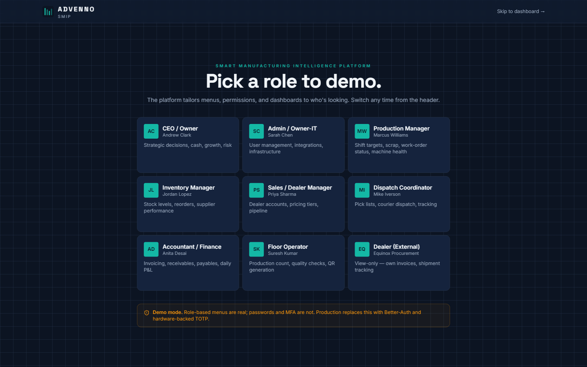
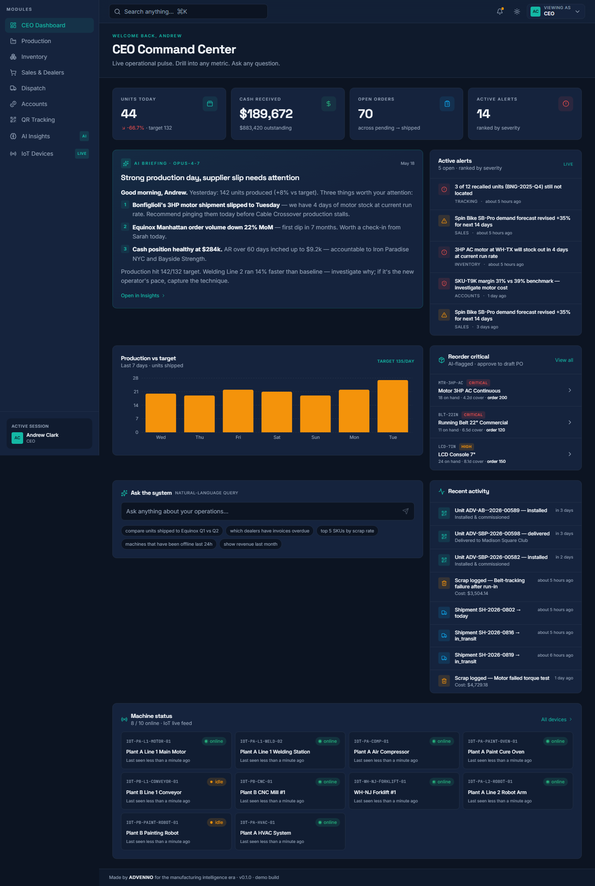
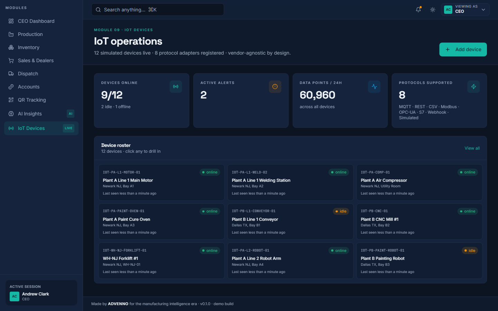
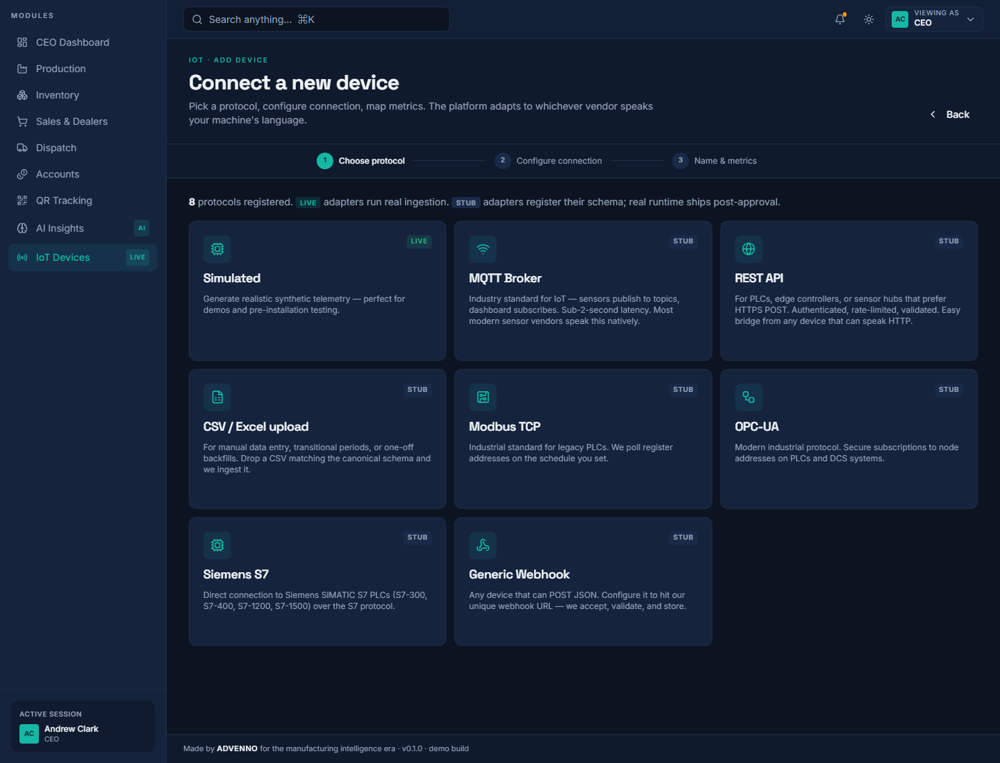
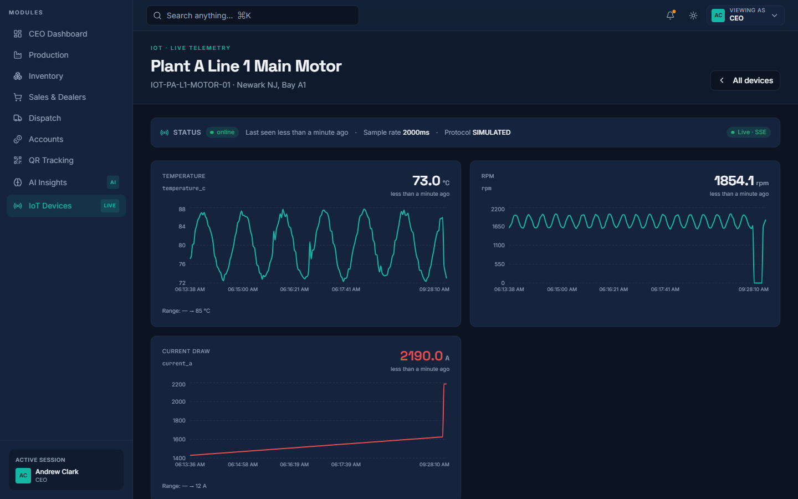
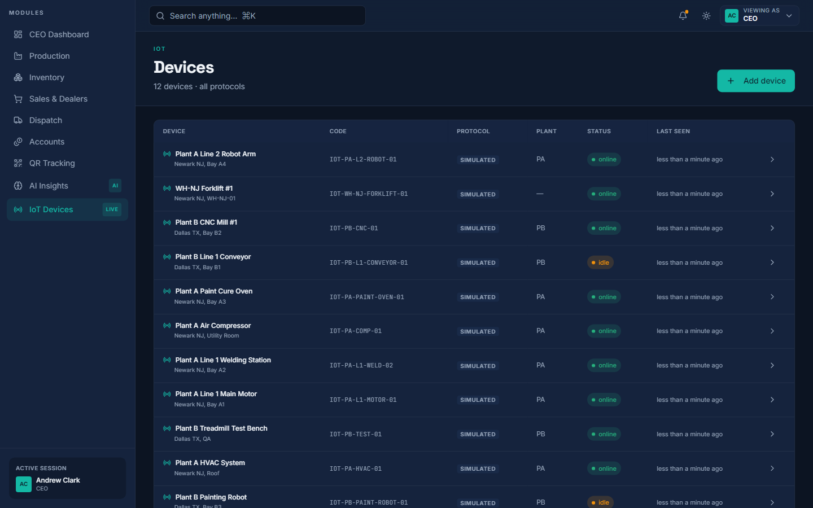
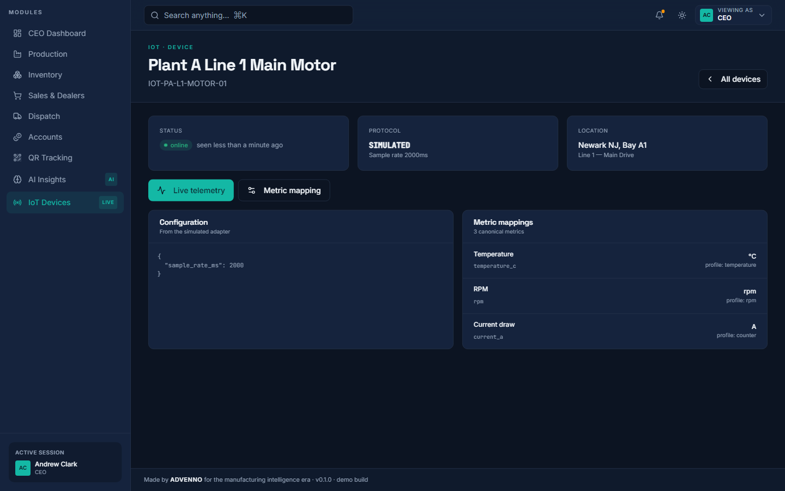
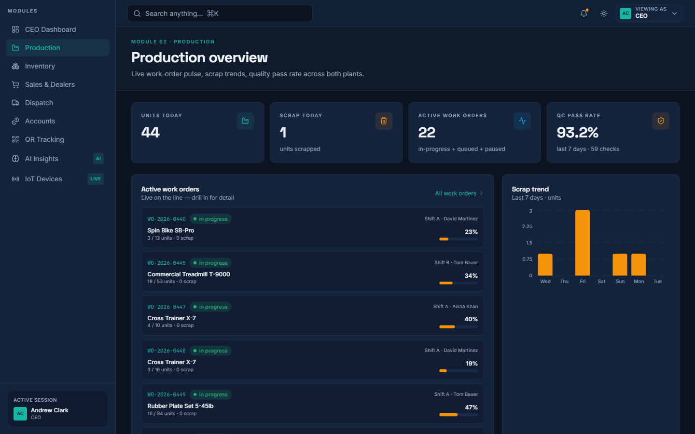

# SMIP - Smart Manufacturing Intelligence Platform

> AI analytics over real-time IoT telemetry for factory floors, with live dashboards and alerting.

Built by **[Muhammad Tanveer](https://www.linkedin.com/in/muhammad-tanveer-advenno/)** - Full-Stack AI Automation Engineer.

 

## Contents

- [The problem](#the-problem)
- [The approach](#the-approach)
- [Architecture](#architecture)
- [Tech stack](#tech-stack)
- [Key capabilities](#key-capabilities)
- [Screenshots](#screenshots)
- [Results](#results)
- [FAQ](#faq)
- [Source code and access](#source-code-and-access)
- [About the engineer](#about-the-engineer)
- [Related projects](#related-projects)

## The problem

Factory machine data existed but was not usable - readings sat in device logs, problems were noticed after output had already suffered, and no one could compare performance across lines or shifts without assembling reports by hand.

## The approach

A platform that ingests machine telemetry continuously, stores it as time series, and puts an analytics and alerting layer on top. Operators get live floor state; supervisors get trends and comparisons. Thresholds and anomaly signals drive alerts so problems surface while they are still cheap to fix.

## Architecture

| Component | Responsibility |
| --- | --- |
| **Ingestion** | Real-time telemetry intake from floor devices |
| **Time-series storage** | Historical readings for trend and comparison |
| **Analytics layer** | Anomaly and threshold evaluation |
| **Dashboard** | Live floor state and historical views |
| **Alerting** | Notification on threshold and anomaly conditions |

## Tech stack

| Layer | Technology |
| --- | --- |
| Frontend | TypeScript, React |
| Backend | Node.js services |
| Data | Time-series telemetry store |
| IoT | Device telemetry integration |
| Analytics | Anomaly and threshold detection |

## Key capabilities

- Real-time machine telemetry ingestion
- Live production dashboards
- Anomaly and threshold alerting
- Historical trend and shift comparison
- Multi-line and multi-machine views

## Screenshots

## Results

- Machine problems surfaced during the shift rather than discovered after it
- One comparable view across lines, replacing hand-built reports

## FAQ

### What does the platform monitor?

Machine-level telemetry from the factory floor, aggregated into live and historical views per line and shift.

### Is it predictive?

It applies anomaly and threshold detection over the telemetry stream to flag developing problems early.

### How does data get in?

Devices report telemetry continuously into an ingestion layer that normalises and stores it as time series.

### Can I see the implementation?

Private repository; access on request.

## Source code and access

This repository is the public case study for **SMIP - Smart Manufacturing Intelligence Platform**. The full implementation - application code, database schema, tests and deployment configuration - lives in a **private repository** on this account, alongside the rest of the work shown here.

Source access can be arranged for hiring conversations, technical review or client due diligence. The quickest route is a short message on [LinkedIn](https://www.linkedin.com/in/muhammad-tanveer-advenno/) or an email to [mtanveertahir66@gmail.com](mailto:mtanveertahir66@gmail.com).

## About the engineer

**Muhammad Tanveer - Full-Stack AI Automation Engineer**

Full-stack AI automation engineer. I build agentic systems, browser and workflow automation, RAG pipelines and the production web platforms they run on - from Rust and Python services to Next.js dashboards and PHP/MySQL business systems.

- GitHub: [haddindeve](https://github.com/haddindeve)
- LinkedIn: [Muhammad Tanveer](https://www.linkedin.com/in/muhammad-tanveer-advenno/)
- Email: [mtanveertahir66@gmail.com](mailto:mtanveertahir66@gmail.com)
- Location: Pakistan

## Related projects

- [AI Sales Agent - Automated Lead Generation and Outreach](https://github.com/haddindeve/advenno-ai-sales-agent)
- [SJ-AIOS - AI Operating System for Retail Operations](https://github.com/haddindeve/sj-aios-ai-operating-system)
- [ATM Electronic Journal Parser and GL Reconciliation](https://github.com/haddindeve/ej-rolls-atm-reconciliation)
- [VideoFactory - Automated AI Video Generation](https://github.com/haddindeve/videofactory-ai-video-generator)
- [ACIP - AI Content Intelligence Platform](https://github.com/haddindeve/bloggen-ai-content-platform)
- [CRAlign - AI Musculoskeletal Wellness Assessment](https://github.com/haddindeve/cralign-msk-wellness-ai)

---

SMIP - Smart Manufacturing Intelligence Platform - case study by Muhammad Tanveer - Full-Stack AI Automation Engineer. Keywords: smart manufacturing platform, IoT analytics dashboard, industrial IoT monitoring, predictive maintenance, real-time telemetry, manufacturing intelligence.